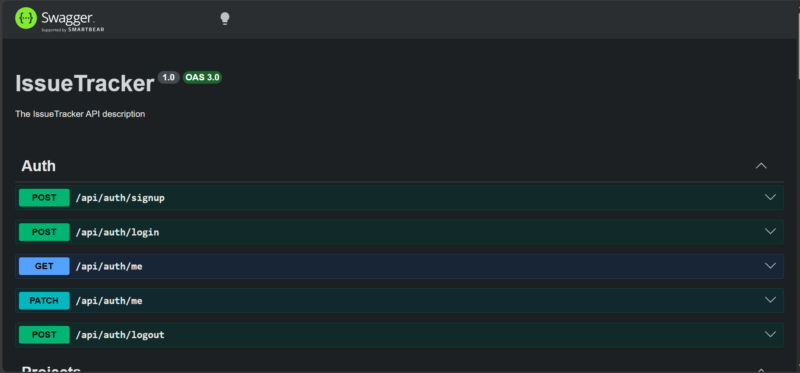

# 📌 IssueTracker API - API for Simple Project Management Focused on Issue Tracking and Team Collaboration (Microservices)



## 📑 Table of Contents

- [Description](README.md#-description)
- [Microservices & System Design](README.md#-microservices--system-design)
- [Key Design Decisions](README.md#-key-design-decisions)
- [Main Features](README.md#-main-features)
- [Technical Highlights](README.md#️-technical-highlights)
- [Architecture](README.md#️-architecture)
- [Installation](README.md#-installation)
- [License](README.md#-license)

## ✨ Description

IssueTracker API is an API for simple project management focused on issue tracking and team collaboration.
Users can create projects, manage issues with different statuses and priorities, invite team members, and collaborate through comments.

This project is a NestJS-based API implementation created as a backend-oriented version of a full-stack IssueTracker originally built with Next.js.

The full-stack Next.js version is available here: https://github.com/rckyrcky/issuetracker

## 💻 Microservices & System Design

- Microservices architecture with REST API Gateway pattern

- Domain-driven service separation (Users, Projects, Issues, Notifications)

- Inter-service communication using RabbitMQ (RPC & event-driven)

- Event-driven data synchronization with denormalization strategy

- Retry mechanism using TTL-based delay queues

- Dead Letter Queue (DLQ) for handling failed messages

- Failure isolation and resilient messaging design

- Dockerized multi-service environment

## 🧠 Key Design Decisions

- Adopted denormalization to avoid cross-service joins

- Used event-driven updates for data consistency

- Implemented retry with delay queues instead of immediate requeue

- Separated business errors and system errors for better retry control

## 🚀 Main Features

- Authentication (sign up / sign in)

- Project creation and management

- Team collaboration via project invitations

- Issue tracking with status and priority

- Comments for discussion on each issue

- Issue history (activity log) to track updates

- Notifications for issue comments and project invitations

- User profile management

## ⚙️ Technical Highlights

- JWT-based authentication with HTTP-only cookies via API Gateway

- Centralized authentication & distributed authorization across services

- Rate limiting using Upstash Redis at API Gateway level

- Selective server-side caching for project resources

- Cursor-based pagination for scalable data fetching

- Schema validation and automated testing

## 🛠️ Architecture

| Component        | Technology               |
| ---------------- | ------------------------ |
| Language         | TypeScript               |
| Framework        | NestJS                   |
| Message Broker   | RabbitMQ                 |
| Containerization | Docker                   |
| Database         | PostgreSQL (per service) |
| ORM              | Drizzle ORM              |

## 📦 Installation

1.  Clone repository

    ```bash
    git clone https://github.com/rckyrcky/issuetracker-api-microservices
    ```

2.  Go to project folder

    ```bash
    cd issuetracker-api-microservices
    ```

3.  Set up environment variables

    Create a .env file based on .env.example and fill in the required values. Each service may have its own environment configuration. Refer to each service's .env.example if needed.

4.  Start infrastructure (PostgreSQL and RabbitMQ)

    ```bash
    docker compose up -d
    ```

5.  Run the setup

    ```bash
    npm run setup
    ```

6.  Run the development server

    ```bash
    npm run start:all
    ```

7.  Basic API documentation is available via Swagger for exploring available endpoints

    http://localhost:3000/docs

## 📜 License

This project is licensed under the MIT License - see the [LICENSE](LICENSE) file for details.

[Back to top](README.md#-issuetracker-api---api-for-simple-project-management-focused-on-issue-tracking-and-team-collaboration-microservices)

© 2026 ricky | [ricky.rf.gd](https://ricky.rf.gd)
